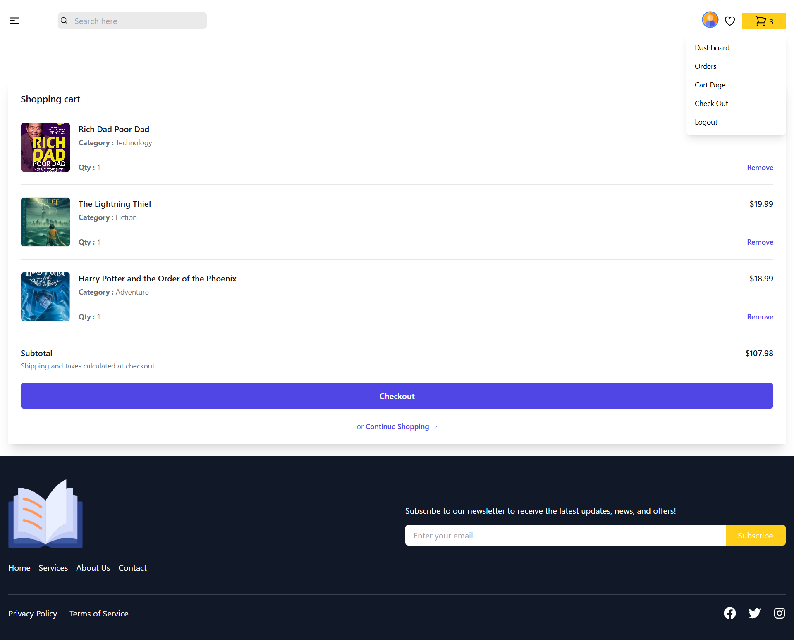
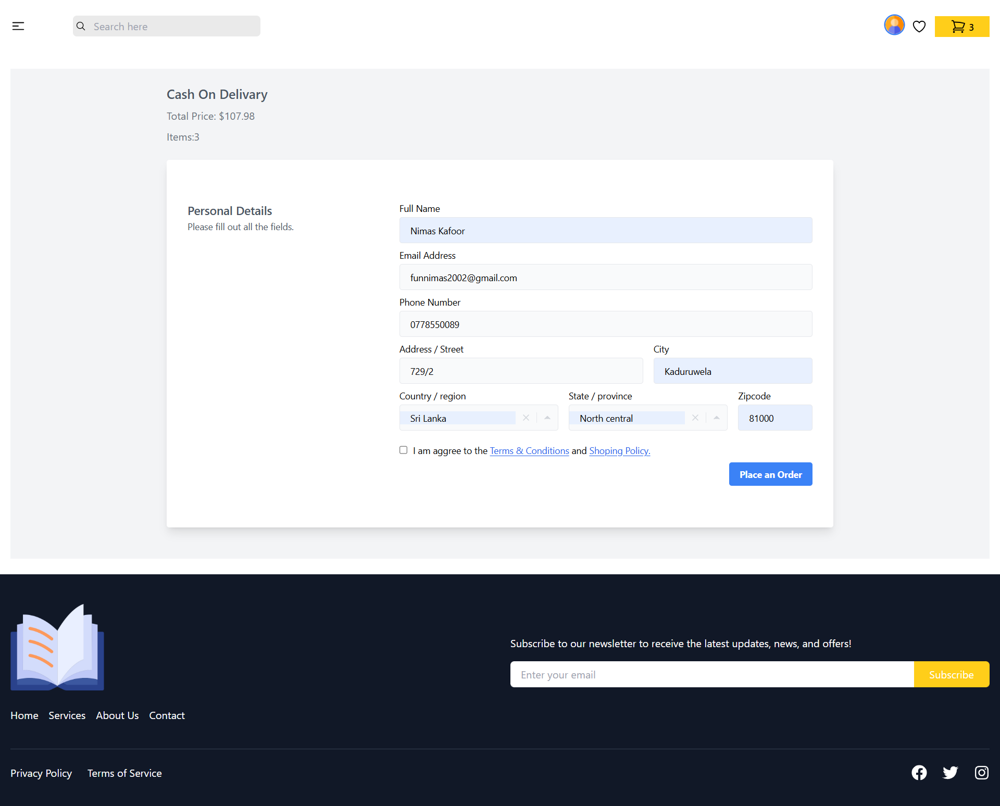
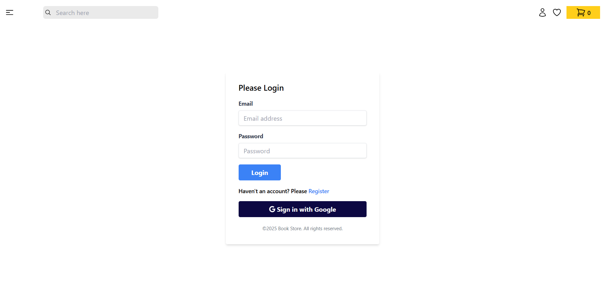

# 📚 Full-Stack Bookstore MERN Application

A modern, full-featured bookstore application built with the MERN stack (MongoDB, Express.js, React, Node.js), featuring authentication, state management, and a responsive UI.

The app uses Tailwind CSS for styling, Firebase for authentication support , JWT token authentication, Redux Toolkit for state management, and local image storage on the server (no Multer or external upload services).

_(Home)_

_(Cart)_

_(Checkout)_

_(Login)_

# Features

Authentication

User registration & login

JWT-based authentication & authorization

Protected routes for admin/user roles

Secure password hashing with bcrypt
